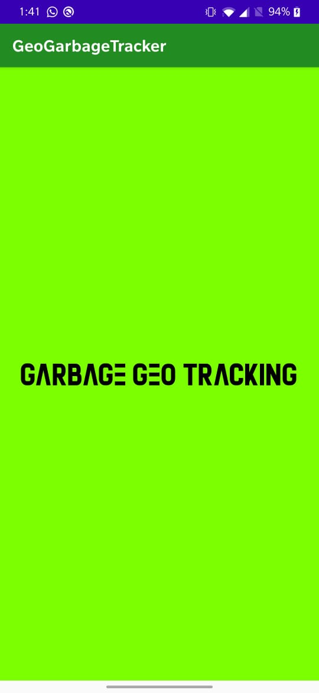
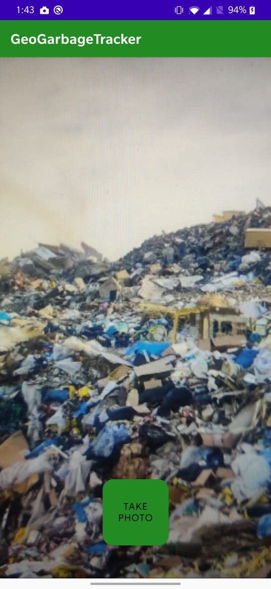

# Garbage-Geo-Tracking

## Introduction

---

An app created for Pragyan Hackathon 21' which is used to monitor garbage disposals in different areas with the info provided by the public. 

## How it works

---

- An user uploads a pictures through the app.
- We get the information of location when the picture is taken and update in the database.
- The locations are reflected in the maps live.
- Heatmap is included for easier navigation between high density areas.

## Tools And Technologies Used

---

- Android Studio
- Kotlin
- Firebase

## Screenshots

---

|                             |                             |                             |
| :-------------------------: | :-------------------------: | :-------------------------: |
|  |  |  |
|  |  |  |

##
## 
# From the Developers

---

### Challenges Faced

We were successfully able to build <a href="https://github.com/tharun571/Geo-Tracking-Garbage-ML-Algo"> Machine Learning Model </a> to predict whether the picture taken is garbage or clean,
but the implementation of the model into the app was not successfull.
It eventually took us time to discover the components but too much time to implement it here.

### Developers

- <a href="https://github.com/dhruvkachhadia">Dhruv</a>
- <a href="https://github.com/tharun571">Tharun</a>
- <a href="https://github.com/pradeep-707">Pradeep</a>

